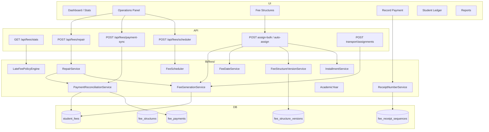

# Fees Module Refactoring (Phases 4–15)

## Architecture



## Folder Structure

```
apps/super-admin/src/lib/fees/
├── AcademicYear.ts              # Calendar vs session month ordering
├── constants.ts                 # Status strings, defaults
├── ensure-fee-extensions.ts     # Extended schema DDL
├── FeeDateService.ts            # calculateDueDate() — single source
├── FeeGenerationService.ts      # All fee generation
├── FeeScheduler.ts              # Cron-ready job entry points
├── FeeStructureVersionService.ts
├── InstallmentService.ts
├── LateFeePolicyEngine.ts
├── PaymentReconciliationService.ts
├── ReceiptNumberService.ts
├── RepairService.ts
├── request-db-adapter.ts
└── index.ts

apps/super-admin/src/app/api/fees/
├── repair/route.ts              # POST explicit repair
├── scheduler/route.ts           # POST scheduled jobs
├── installment-plans/route.ts   # GET/POST installment config
├── payment-sync/route.ts        # Tenant-scoped reconciliation
├── student-fees/route.ts        # GET only (read-only)
├── stats/route.ts               # GET only (read-only)
└── ...
```

## Files Modified

| Area | Files |
|------|-------|
| Due dates | `FeeDateService.ts`, `FeeGenerationService.ts`, `exempt-all/route.ts`, `AcademicYear.ts` |
| Reconciliation | `PaymentReconciliationService.ts`, `paymentSync.js` (shim), `payment-sync/route.ts` |
| GET side effects removed | `student-fees/route.ts`, `stats/route.ts`, `structures/route.ts` (GET) |
| Repair | `RepairService.ts`, `repair/route.ts`, `FeesOperationsPanel.tsx` |
| Transport | Removed from GET `student-fees`; kept on transport assignment APIs |
| Versioning | `FeeStructureVersionService.ts`, `structures/route.ts` POST/PUT |
| Installments | `InstallmentService.ts`, `installment-plans/route.ts`, generation path |
| Late fees | `LateFeePolicyEngine.ts`, `student-fees/route.ts` |
| Receipts | `ReceiptNumberService.ts`, `bulk-payment/route.ts`, `fees/route.ts` |
| Legacy removed | Deleted `fees/legacy/page.tsx`, `ViewStudentFeesModal`, `SimpleRecordPaymentModal` |
| Schema | `ensure-fee-schema.ts`, `ensure-fee-extensions.ts` |
| Scheduler | `FeeScheduler.ts`, `scheduler/route.ts` |

## Database Changes

New tables (via `ensureFeeExtensions` or `phase23_fees_refactoring.sql`):

- `fee_structure_versions` — immutable version history
- `fee_installment_plans` — configurable installment counts per structure
- `fee_installments` — per-student installment rows
- `fee_receipt_sequences` — school-scoped sequential receipt numbers
- `fee_late_fee_policies` — advanced late-fee rules

New columns:

- `fee_structures.current_version_id`
- `student_fees.fee_structure_version_id`

Indexes on `student_fees`, `fee_payments` for dashboard/report performance.

## Migration

Run: `database/migrations/phase23_fees_refactoring.sql`

Schema is also auto-applied on first fee API call via `ensureFeeSchema` → `ensureFeeExtensions`.

## API Compatibility

| Endpoint | Change | Breaking? |
|----------|--------|-----------|
| `GET /api/fees/stats` | No longer auto-repairs/cleans | No — same response shape |
| `GET /api/fees/student-fees` | No transport sync / orphan cleanup | No — same response shape |
| `GET /api/fees/structures` | No duplicate auto-cleanup | No — same response shape |
| `POST /api/fees/payment-sync` | Now tenant-scoped via `getRequestDb` | No — same actions |
| `POST /api/fees/repair` | **New** — explicit repair | N/A |
| `POST /api/fees/scheduler` | **New** — job runner | N/A |
| `POST /api/fees/installment-plans` | **New** — installment config | N/A |
| Receipt numbers | Format `RCP-2026-000001` (was random) | No — field name unchanged |

## Performance Improvements

- Indexes on `(student_id, academic_year)`, `(fee_structure_id, academic_year)`, `(academic_year, status)`
- Index on `fee_payments(student_id, payment_date DESC)`
- Removed background reconciliation from stats GET (reduces load on every dashboard view)
- N+1 late-fee calculation remains per-row but uses cached policy lookup

## Breaking Changes

None intentional. Receipt number **format** changed to sequential (still unique per school/year).

**Data note:** Pre-Phase-3 rows may store session index (1=April) instead of calendar month (4=April). Run a one-time data migration if legacy rows exist.

## Suggested Future Improvements

1. Wire cron/worker to `POST /api/fees/scheduler`
2. UI for installment plan configuration on fee structure form
3. UI for late-fee policy management
4. Materialized view for dashboard aggregates
5. One-time migration script for month column normalization
6. Unit tests for `FeeDateService`, `LateFeePolicyEngine`, `PaymentReconciliationService`
7. Deprecate and remove `paymentSync.js` / `autoFeeSync.js` shims after full tenant migration

## Fee Lifecycle Verification

```
Fee Structure → POST /api/fees/structures (+ version + optional installments)
     ↓
Fee Assignment → FeeGenerationService (assign-bulk / auto-assign / transport assign)
     ↓
Student Fees → student_fees (+ fee_structure_version_id)
     ↓
Payment → bulk-payment / fees POST (+ ReceiptNumberService)
     ↓
Receipt → payment_receipts (optional)
     ↓
Reports / Dashboard / Ledger → GET stats, reports, student-fees (read-only)
     ↓
Repair (when needed) → POST /api/fees/repair or Operations panel
```

## Operations Panel Actions

| Action | API |
|--------|-----|
| Generate Monthly Fees | `POST /api/fees/assign-bulk` |
| Auto Assign | `POST /api/fees/auto-assign` |
| Assign Missing | `POST /api/fees/assign-missing` |
| Full Data Repair | `POST /api/fees/repair` |
| Fee Reconciliation | `POST /api/fees/payment-sync` |
| Cleanup Orphans | `POST /api/fees/repair` (orphans only) |
